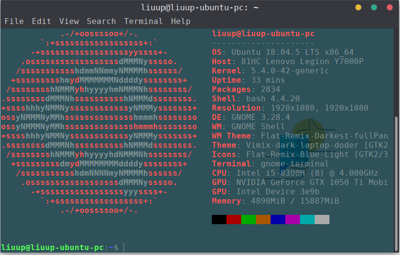
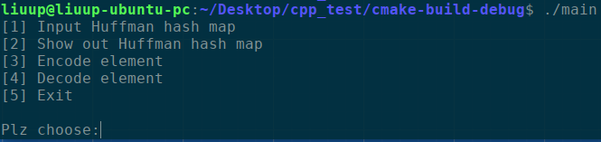
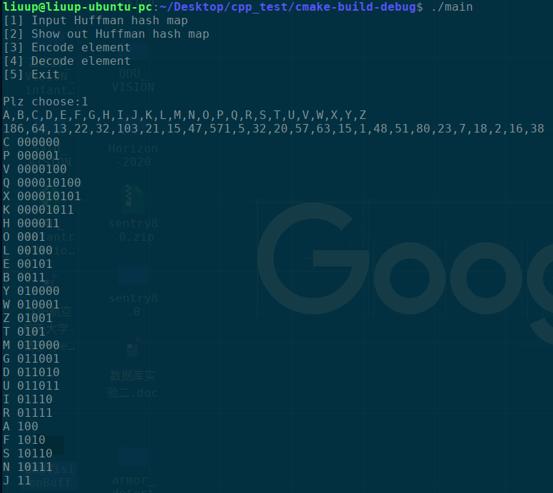
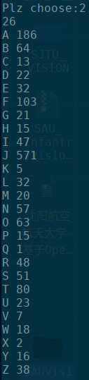
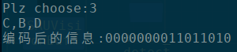
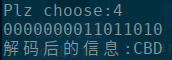

# 数据结构课设-通讯发报应用
沈阳航空航天大学计算机科学与技术1803班刘上183424080320  

## 课设内容:
在通讯发报应用中，要处理的信息来自下面的字符集，各个字符的相关使用频度如下:   

字符：  
A,B,C,D,E,F,G,H,I,J,K,L,M,N,O,P,Q,R,S,T,U,V,W,X,Y,Z 

字符频度：  
186,64,13,22,32,103,21,15,47,571,5,32,20,57,63,15,1,48,51,80,23,7,18,2,16,38 

Test dataset:  
A,B,C,D,E,F,G,H,I,J,K,L,M,N,O,P,Q,R,S,T,U,V,W,X,Y,Z  
186,64,13,22,32,103,21,15,47,571,5,32,20,57,63,15,1,48,51,80,23,7,18,2,16,38

Test data:  
1000011000000

## 设计要求： 
1. 由用户来输入初始字符集、相应字符及字符频度； 
2. 输入一个要发报的字符串，将其编码后发报； 
3. 接收一组发报信息，将其还原为字符序列。 

## 开发环境
Linux Ubuntu 18.04.5Lts  
CLion 2020.3  
g++ 7.5.0  
C++ 11  
cmake 3.10.2    
make 4.1  



## 运行代码
1. ```~$git clone https://github.com/liuup/Huffman```
2. ```~$cd Huffman```
3. ```~$mkdir build && cd build```
4. ```~$cmake ..```
5. ```~$make -j8```
6. ```~$./main```

## 运行截图
运行编译后的程序后,会出现以下5个选项:    


选择1后,将让用户输入字符与字符频度  


选择2后,将显示字符与字符频道  


选择3后.将提示用户输入预编码的字符并打印出来编码值  


选择4后,将提示用户输入编码值并打印出来解码后的字符  

